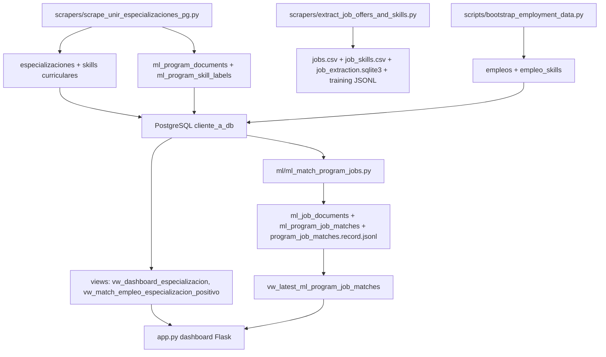

# Core Operativo Oficial

Fecha: 2026-05-15

## Decision Arquitectonica

El core operativo oficial queda definido como una plataforma PostgreSQL-first:

```text
scrapers curriculares + scrapers laborales
  -> extraccion y normalizacion de skills
  -> PostgreSQL
  -> matching rules/ML auditable
  -> backend/dashboard
  -> frontend operativo
```

No se elimina ningun archivo en esta fase. Los wrappers de raiz se mantienen para compatibilidad.

## Entry Points Detectados

| Rol | Oficial actual | Estado |
| --- | --- | --- |
| Backend principal actual | `app.py` | CORE actual, Flask + PostgreSQL + dashboard server-side |
| App principal actual | `app.py` | CORE actual, rutas `/`, `/dashboard`, `/dashboard/programa/<id>`, `/registro` |
| Scraper principal curricular | `scrapers/scrape_unir_especializaciones_pg.py` | CORE recomendado para programas UNIR enriquecidos |
| Scraper curricular legacy/amplio | `scrapers/scraper.py` | CORE compatible, mantener mientras se fusiona |
| Extraccion laboral principal | `scrapers/extract_job_offers_and_skills.py` | CORE para ofertas, skills, CSV/SQLite/JSONL |
| Wrapper laboral publico | `scrapers/public_jobs_scraper.py` | CORE operativo como fachada CLI |
| Pipeline ML principal | `ml/ml_match_program_jobs.py` | CORE oficial de matching auditable |
| Sistema de matching principal | `ml_program_job_matches` + `vw_latest_ml_program_job_matches` | CORE si la vista existe; `app.py` usa fallback por `empleo_skills` |
| Frontend principal actual | UI embebida en `app.py` | CORE operativo actual |
| Frontend objetivo | `graduate_intelligence_platform/frontend` | Prototipo React/Vite a promover |
| API FastAPI objetivo | `graduate_intelligence_platform/backend/app/main.py` | Prototipo API in-memory a migrar a PostgreSQL |

## Flujo Real De Datos



## Tablas Y Vistas Relevantes

### Curriculo

- `especializaciones`
- `skills`
- `herramientas`
- `competencias`
- `habilidades_blandas`
- `especializacion_skills`
- `especializacion_herramientas`
- `especializacion_competencias`
- `especializacion_habilidades_blandas`
- `perfiles_egreso`

### Mercado Laboral

- `empleos`
- `empleo_skills`

### ML / Auditoria

- `ml_training_runs`
- `ml_job_documents`
- `ml_skill_labels`
- `ml_training_examples`
- `ml_program_documents`
- `ml_program_skill_labels`
- `ml_program_job_matches`

### Vistas Operacionales

- `vw_skills_normalizadas`
- `vw_empleos_normalizados`
- `vw_match_empleo_especializacion`
- `vw_match_empleo_especializacion_positivo`
- `vw_dashboard_especializacion`
- `mv_dashboard_especializacion`
- `vw_latest_ml_program_job_matches` cuando se aplica `ml_training_schema.sql`

## Outputs Generados

- `data/raw/*`: datasets historicos fuente.
- `archive/outputs/job_extraction_output*/jobs.csv`: ofertas extraidas.
- `archive/outputs/job_extraction_output*/job_skills.csv`: relacion oferta-skill.
- `archive/outputs/job_extraction_output*/job_extraction.sqlite3`: snapshot local.
- `data/ml/*.jsonl`: training profiles, matches y ejemplos JSONL.
- PostgreSQL: fuente de verdad operacional.

## Datasets Que Alimentan ML

- `ml_program_documents` y `ml_program_skill_labels`, generados desde programas UNIR.
- `empleos` y `empleo_skills`, generados desde CSV laborales mediante bootstrap.
- JSONL de `data/ml/` para entrenamiento/evaluacion externa.
- `program_job_matches.record.jsonl` como export auditable del matching.

## Core Oficial Del Producto

1. Scraper oficial curricular: `scrapers/scrape_unir_especializaciones_pg.py`.
2. Scraper oficial laboral: `scrapers/extract_job_offers_and_skills.py`, ejecutado directo o por `scrapers/public_jobs_scraper.py`.
3. Motor extraccion oficial: funciones de skill extraction de `graduate_intelligence_platform/backend/app/engine.py`, reutilizadas por extractores.
4. Motor matching oficial: `ml/ml_match_program_jobs.py`.
5. Backend oficial actual: `app.py`.
6. Backend objetivo: FastAPI en `backend/app`, migrando logica desde `app.py` y `graduate_intelligence_platform/backend/app/main.py`.
7. Frontend oficial actual: templates server-side dentro de `app.py`.
8. Frontend objetivo: React/Vite de `graduate_intelligence_platform/frontend`, movido gradualmente a `frontend/`.
9. Base de datos oficial: PostgreSQL `cliente_a_db` en puerto local `5433`, manteniendo Docker Postgres.
10. Pipeline ML oficial: PostgreSQL -> `ml_training_schema.sql` -> `ml_match_program_jobs.py` -> vistas ML -> dashboard/API.

## Scripts Criticos

- `app.py`
- `build_unir_especializaciones_db.py`
- `backend/db.py`
- `backend/queries.py`
- `scrapers/scrape_unir_especializaciones_pg.py`
- `scrapers/scraper.py`
- `scrapers/extract_job_offers_and_skills.py`
- `scrapers/public_jobs_scraper.py`
- `ml/ml_match_program_jobs.py`
- `ml/ml_training_schema.sql`
- `scripts/bootstrap_employment_data.py`
- `scripts/clean_skill_catalog.py`

## Scripts Realmente Usados

- `Dockerfile`, `docker-compose.yml`
- wrappers de raiz para compatibilidad: `scraper.py`, `public_jobs_scraper.py`, `ml_match_program_jobs.py`, etc.
- `scripts/run_unir_market_scraper.ps1` si se sigue usando el flujo manual de mercado UNIR/Ticjob.
- `scripts/sync_jasper_to_postgres.py` si existe ingestion externa desde Jasper/CSV.

## Scripts Legacy U Obsoletos

- `archive/legacy/apps/asturias_bi_app.py`
- `archive/legacy/apps/curriculum_intelligence_platform.py`
- `archive/legacy/apps/curriculum_intelligence_platform.html`
- `archive/legacy/apps/unir_alumni_alerts_app.py`
- `archive/legacy/apps/video_creator_app.py`
- `archive/legacy/apps/main.py`
- `archive/legacy/apps/run_video_creator_5050.py`
- `archive/legacy/apps/start_preview.py`
- `archive/legacy/build_asturias_match_system.ps1`

## Scripts Duplicados / Redundantes

- `scrapers/scraper.py` y `scrapers/scrape_unir_especializaciones_pg.py` comparten dominio curricular; consolidar alrededor del segundo por tener persistencia ML/program documents.
- `scrapers/ticjob_scraper.py`, `scrapers/ticjob_deep_bi_scraper.py`, `scrapers/ticjob_bi_skills_job.py`, `scrapers/unir_market_scraper.py` son variantes laborales/fuente; convertirlos en adaptadores bajo `scrapers/sources/`.
- `scrapers/public_jobs_scraper.py` es wrapper de `extract_job_offers_and_skills.py`; mantener como CLI de conveniencia.
- Outputs `archive/outputs/job_extraction_output_real_test*` y `job_extraction_output_public*` son snapshots repetidos, conservar hasta validar calidad.

## Consolidacion Propuesta

### Mover A Archive Despues De Confirmacion

- Wrappers de raiz que ya no se usen cuando existan comandos oficiales.
- Variantes `ticjob_deep_bi_scraper.py` y `ticjob_bi_skills_job.py` tras migrar su logica a adaptadores.
- Outputs de prueba con pocos registros.
- Dependencias vendorizadas cuando Docker/requirements quede completamente reproducible.

### Fusionar

- `scrapers/scraper.py` + `scrapers/scrape_unir_especializaciones_pg.py` en `scrapers/pipelines/program_scraper.py`.
- `ticjob_*`, `unir_market_scraper.py`, `linkedin_*` en `scrapers/sources/{ticjob,unir_market,linkedin}.py`.
- SQL de `scripts/bootstrap_employment_data.py`, `database/vw_especializaciones_analitica.sql` y `ml/ml_training_schema.sql` en migraciones.

### Convertir En Modulos

- Extraccion de skills: `ml/features/skill_extraction.py`.
- Normalizacion/canonizacion: `backend/app/services/normalization_service.py`.
- Repositorios PostgreSQL: `backend/app/db/repositories.py`.
- Matching: `ml/pipelines/program_job_matching.py`.
- Views refresh/bootstrap: `database/migrations` y `scripts/refresh_views.py`.

### Convertir En APIs

- `GET /api/programs`
- `GET /api/programs/{id}/dashboard`
- `GET /api/programs/{id}/matches`
- `GET /api/market/jobs`
- `POST /api/scraping/runs`
- `POST /api/ml/matching-runs`
- `GET /api/ml/runs/{id}`
- `GET /api/health`

## Arquitectura Productiva Recomendada

```text
backend/
  app/
    api/              routers FastAPI
    core/             config, logging, auth
    db/               connection pool, repositories
    schemas/          Pydantic DTOs
    services/         orchestration/application services
frontend/
  src/                React/Vite productivo
ml/
  features/           normalizacion, skill extraction
  pipelines/          matching, training exports
  evaluation/         metricas y validacion
scrapers/
  sources/            adaptadores por portal/fuente
  extractors/         parsing, json-ld, html, skill extraction
  config/             configs de fuentes
database/
  migrations/         Alembic o SQL versionado
  views/              vistas dashboard/ML
data/
  raw/
  processed/
  ml/
```

## Riesgos Tecnicos

- `app.py` concentra UI, SQL, registro, matching fallback y rendering; es el mayor riesgo de mantenibilidad.
- FastAPI actual usa `InMemoryStore`; no es todavia backend productivo.
- Hay dos mecanismos de matching: vistas SQL de bootstrap y `ml_program_job_matches`; debe quedar uno como fuente oficial.
- `scripts/bootstrap_employment_data.py` hace `DROP` de tablas laborales; es riesgoso en produccion.
- La ruta del schema ML en `scrape_unir_especializaciones_pg.py` ya tiene fallback hacia `ml/ml_training_schema.sql`; mantener esta compatibilidad al modularizar.
- Credenciales default en Docker/scripts.
- Falta versionado formal de migraciones, run ids y contratos API.

## Recomendaciones FastAPI

- Crear `backend/app/main.py` productivo y mover rutas desde Flask gradualmente.
- Usar `psycopg_pool` o SQLAlchemy Core para conexiones.
- Mantener Pydantic schemas por entidad: Program, Skill, Job, Match, MLRun.
- Exponer dashboard como API JSON; dejar React como consumidor.
- Mantener Flask `app.py` en paralelo hasta que React/FastAPI cubran las rutas actuales.

## Recomendaciones Docker

- Separar servicios:
  - `api`: FastAPI.
  - `dashboard-legacy`: Flask actual mientras migra.
  - `worker-scraper`: scraping programado.
  - `worker-ml`: matching y export JSONL.
  - `frontend`: Vite build servido por Nginx.
  - `db`: PostgreSQL.
- Usar comandos por servicio; hoy `scraper` y `dashboard` construyen la misma imagen y ejecutan el mismo CMD.
- Mover secretos a `.env` y no a compose hardcoded.
- Montar `data/` y `logs/` como volumen solo en workers.

## Recomendaciones ML

- Declarar `ml_training_runs` como registry oficial de datasets/runs.
- Guardar version de algoritmo, parametros, hashes de entrada y metricas.
- Mantener `local_rules_v1` como baseline reproducible.
- Separar scoring online de batch offline.
- Agregar evaluacion con splits y muestras revisadas manualmente antes de entrenar modelos supervisados.
- Producir `vw_latest_ml_program_job_matches` como contrato estable para dashboard/API.

## Secuencia Recomendada De Produccion

1. Crear migraciones versionadas para tablas base, vistas dashboard y tablas ML.
2. Convertir `bootstrap_employment_data.py` en job idempotente sin `DROP` destructivo.
3. Extraer servicios desde `app.py` sin cambiar comportamiento.
4. Crear FastAPI leyendo de PostgreSQL.
5. Conectar React/Vite a FastAPI.
6. Separar Docker por servicio.
7. Archivar redundantes solo despues de pruebas de paridad.
